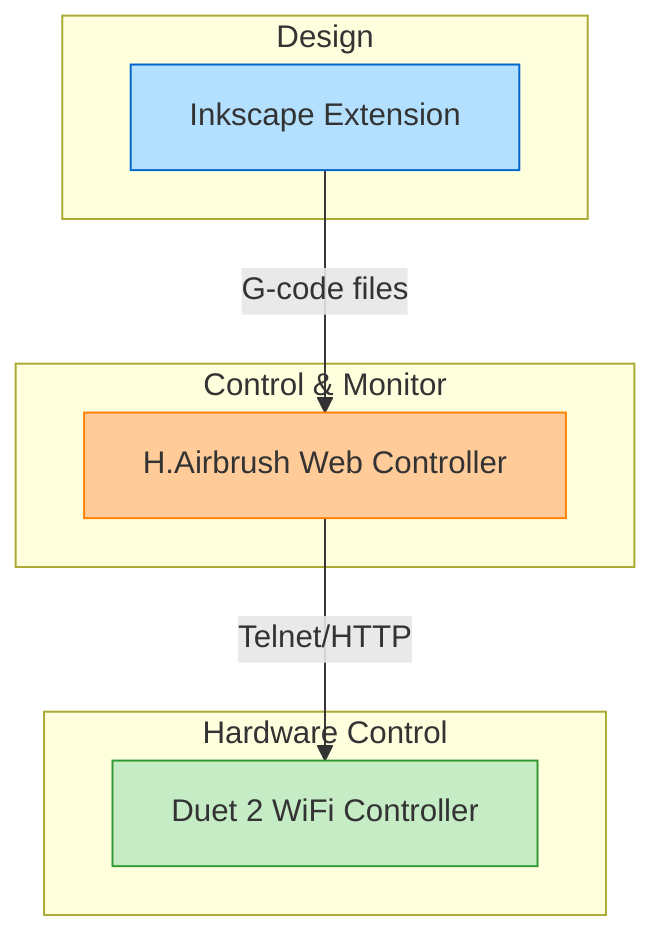
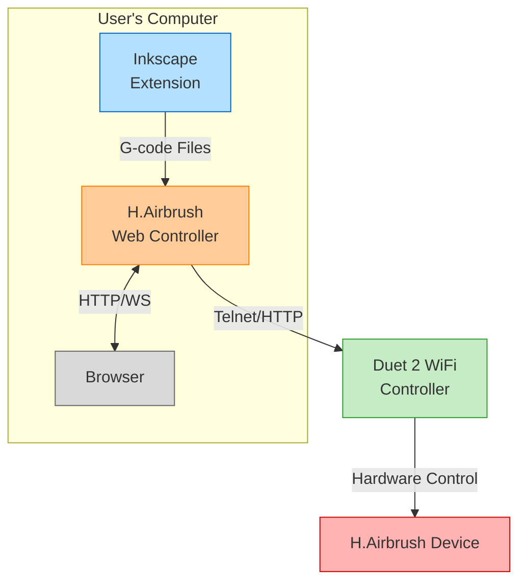

# H.Airbrush System Architecture Overview

## System Components

## 1. Inkscape Extension Component

**Purpose:** SVG processing and G-code generation

**Key Modules:**
- `hairbrush.inx`: Extension UI definition
- `hairbrush_control.py`: Main extension entry point
- `hairbrush_lib/svg_parser.py`: SVG path processing
- `hairbrush_lib/path_processor.py`: Path optimization
- `hairbrush_lib/gcode_generator.py`: G-code generation

**Responsibilities:**
- Parse SVG files and extract paths
- Process paths (simplification, optimization)
- Generate G-code based on SVG attributes
- Export G-code files
- Configure output settings (scale, offsets, etc.)
- Provide basic preview functionality

**Data Flow:**
1. User creates/edits design in Inkscape
2. User configures export settings in extension UI
3. Extension generates G-code file
4. G-code file is saved to user-specified location

## 2. H.Airbrush Web Controller Component

**Purpose:** Machine control and monitoring

**Key Modules:**
- `web_server.py`: Flask web server
- `duet_client.py`: Communication with Duet controller
- `job_manager.py`: G-code job management
- `templates/`: Web UI templates
- `static/`: CSS, JavaScript, and images

**Responsibilities:**
- Provide web interface for machine control
- Upload and manage G-code files
- Stream G-code to Duet controller
- Monitor machine status and progress
- Provide real-time feedback
- Handle error conditions
- Manage machine configuration

**Data Flow:**
1. User opens web interface in browser
2. User uploads G-code file generated by Inkscape extension
3. Web controller processes and validates G-code
4. User initiates job execution
5. Controller streams G-code to Duet via Telnet/HTTP
6. Controller provides real-time status updates

## 3. Duet 2 WiFi Controller Component

**Purpose:** Hardware control and execution

**Interaction Points:**
- Telnet interface for G-code streaming
- HTTP API for status monitoring
- WebSocket for real-time updates

**Responsibilities:**
- Execute G-code commands
- Control stepper motors
- Control airbrush activation
- Control paint flow
- Report machine status
- Handle hardware-level safety features

## Communication Protocols

### Inkscape Extension to Web Controller
- File-based: G-code files
- Optional direct API integration for seamless workflow

### Web Controller to Duet 2 WiFi
- Primary: Telnet for G-code streaming (port 23)
- Secondary: HTTP API for status and configuration (port 80)
- Optional: WebSocket for real-time updates

## Data Models

### G-code File Format
- Standard G-code with H.Airbrush-specific extensions
- Special comments for brush selection and paint flow
- Metadata section with job parameters

### Machine Configuration
- IP address and communication settings
- Machine dimensions and limits
- Brush configurations (offsets, flow rates)
- Calibration data

### Job Status Model
- Current position (X, Y, Z)
- Active tool/brush
- Job progress (percentage, line number)
- Estimated time remaining
- Error conditions

## User Interface Components

### Inkscape Extension UI
- Export settings (scale, position, resolution)
- Brush configuration (mapping colors to brushes)
- Path processing options (simplification, ordering)
- Preview functionality

### Web Controller UI
- Machine connection status
- File management (upload, select, delete)
- Job control (start, pause, stop)
- Real-time visualization of job progress
- Manual control interface
- Configuration settings
- Error notifications

## Deployment Architecture

## Security Considerations

- Local network operation only (no internet exposure)
- Basic authentication for web interface
- Input validation for all G-code files
- Safety limits enforced in software
- Emergency stop functionality

## Error Handling Strategy

- Connection loss detection and recovery
- G-code validation before execution
- Real-time error reporting
- Job recovery after interruption
- Logging for troubleshooting

## Future Extensibility

- Plugin system for additional features
- Support for multiple machine configurations
- Advanced path planning algorithms
- Integration with other design tools
- Mobile app support

This architecture separates concerns appropriately, provides a robust foundation for development, and offers a good user experience by keeping design and control functions in purpose-built interfaces. 