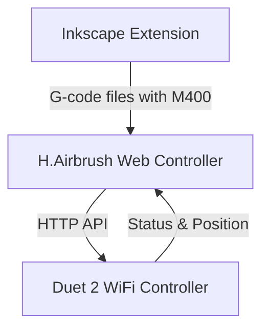

# Active Context

## Current Focus
We are implementing the H.Airbrush system architecture with three main components:
1. **Inkscape Extension** - SVG processing and G-code generation (95% complete)
2. **Web Controller** - Machine control and monitoring interface (95% complete)
3. **Duet 2 WiFi Controller** - Hardware control and execution (20% complete)

The immediate focus is on completing the Web Controller component with testing, optimization, and documentation. The core functionality has been implemented, including G-code file management, machine control, status monitoring, endstop monitoring, settings persistence, and setup page improvements.

## Recent Implementations

1. **Setup Page Improvements**
   - Fixed USB serial connection for device discovery
   - Added reliable IP address detection via serial communication
   - Implemented background thread for capturing IP address from serial data
   - Added hierarchical diagnostic command menu with commands from YAML file
   - Fixed connection history management and persistence
   - Added automatic disconnection when leaving or reloading the page
   - Improved error handling for serial communication
   - Fixed "Already connected" errors with proper resource management

2. **Paint Flow Control System**
   - Implemented calibrated paint flow control with min/max servo angle settings for each brush
   - Added Paint Servo Lower Limit and Upper Limit settings to define the servo angles for 0% and 100% paint flow
   - Created test buttons to verify min/max settings with air flow for calibration
   - Implemented percentage-to-servo-angle scaling for intuitive user control
   - Added safety features to return servos to minimum position when saving settings
   - Implemented automatic air shutoff when saving settings or leaving the page
   - Added server-side support with set_brush_paint_flow method in MachineControl class
   - Created API endpoints and Socket.IO handlers for paint flow control
   - Updated brush settings UI with intuitive controls and clear labels

3. **Global WebSocket Manager**
   - Created a centralized WebSocket connection manager that persists across tabs
   - Implemented event listener pattern for connection, status, and job updates
   - Added connection state tracking and automatic reconnection
   - Updated all components to use the global manager instead of direct socket access
   - Added fallback mechanisms for backward compatibility
   - Fixed tab-switching disconnection issues by centralizing connection handling
   - Added comprehensive error handling and user feedback for connection issues

4. **JavaScript Console Error Fixes**
   - Fixed "disableMotionControls is not defined" error by moving function to global scope
   - Improved initialization sequence to handle cases where elements might not be available
   - Fixed visualization elements check with proper fallback for canvas visualization
   - Enhanced socket initialization to use the global WebSocket manager with better error handling
   - Fixed requestMachineStatus function to handle connection errors properly
   - Added proper connection state checks before attempting status requests
   - Implemented timeout handling for requests that might hang
   - Added graceful error handling to prevent unhandled promise rejections

5. **Configuration Cleanup**
   - Removed Telnet port settings from the UI and config.yaml since they're no longer needed with RepRap firmware
   - Updated connection settings UI to focus on HTTP API communication
   - Updated app.py docstring to reflect the use of HTTP API instead of Telnet
   - Simplified connection settings by removing deprecated options
   - Updated HTTP port description to clarify it's used for RepRap firmware communication

6. **WebSocket Connection Reliability Improvements**
   - Fixed silent WebSocket disconnection issues
   - Added robust reconnection handling with user feedback
   - Improved error handling in connection.js and websocket.js
   - Added toast notifications for connection errors
   - Fixed UI state synchronization when connections drop
   - Added timeout handling for WebSocket commands
   - Improved error handling in server-side WebSocket event handlers
   - Fixed get_status API to handle missing brush state methods

7. **Machine Status Handling Improvements**
   - Fixed "DuetClient object has no attribute 'is_homed'" error by implementing the missing method
   - Added error handling for status requests in both client and server code
   - Improved JavaScript status notification with safe default values
   - Added graceful fallbacks for missing status attributes
   - Enhanced error handling in handle_get_status socket handler
   - Implemented client-side data sanitization to prevent UI errors

8. **Settings Persistence Reliability**
   - Added configuration file backup before saving
   - Implemented atomic file writes using temporary files
   - Added validation for settings before applying
   - Improved error handling during settings save operations
   - Added backup restoration if save operations fail

9. **Visualization Improvements**
   - Replaced DOM/CSS-based visualization with HTML5 Canvas implementation
   - Fixed brush position visualization with proper offsets
   - Added grid lines with numeric scale indicators
   - Implemented proper origin (0,0) at center of paper
   - Added high-DPI support for retina displays
   - Improved brush position updates with real-time feedback
   - Added position and brush offset text display
   - Ensured visualization updates when brush offsets change in settings

10. **Settings Persistence**
    - Created settings.js to handle loading and saving settings
    - Added API endpoints for getting and setting configuration
    - Implemented settings persistence to config.yaml file
    - Connected settings changes to visualization updates
    - Added toast notifications for settings feedback
    - Fixed connection handling in the settings page
    - Implemented test connection functionality

11. **Movement Control Fixes**
    - Fixed jog controls to respect selected distance and speed settings
    - Modified jog button handling to use direction from button but magnitude from selected distance
    - Updated Z-axis home button to properly send G28 Z command
    - Improved error handling in movement control functions
    - Added Enable Motors button as toggle counterpart to Disable Motors (using M17 command)
    - Converted brush control buttons to toggle style with visual state indication
    - Added paint intensity sliders with percentage control for precise paint flow adjustment
    - Improved paint control layout with full-width buttons and sliders positioned below
    - Disabled jog and home buttons when motors are disabled for safety

## Key Accomplishments
1. **Inkscape Extension**
   - Created modular architecture following AxiDraw model
   - Implemented SVG parsing with layer detection
   - Fixed critical G-code generation issues
   - Added M400 commands for motion synchronization

2. **Web Controller**
   - Created Flask application with WebSocket support
   - Implemented Duet client for HTTP API communication
   - Developed job management and machine control
   - Built responsive web UI with dashboard and control panel
   - Added support for processing G-code files with M400 synchronization points
   - Implemented endstop monitoring with real-time status display
   - Improved machine control interface layout and usability
   - Created canvas-based visualization with proper scaling and offsets
   - Implemented settings persistence to config.yaml
   - Added reliable IP address discovery via USB serial connection
   - Implemented diagnostic command menu for device troubleshooting

3. **Architecture Planning**
   - Defined component responsibilities and interfaces
   - Established data models and communication protocols
   - Documented system architecture and design decisions

## Architecture Overview

### Component Responsibilities
- **Inkscape Extension**: SVG processing, path optimization, G-code generation with M400 sync points
- **Web Controller**: Machine control interface, G-code management, status monitoring, M400 handling, endstop monitoring, settings persistence
- **Duet Controller**: Hardware control, G-code execution, status reporting, endstop status

## Duet Communication Strategy
- **HTTP API Communication**: Used for G-code commands and status monitoring (port 80)
- **Motion Synchronization**: Use `M400` to wait for moves to complete (IMPLEMENTED)
- **Position Monitoring**: Use `M114` to query current position (IMPLEMENTED)
- **Endstop Monitoring**: Use `M119` to query endstop status (IMPLEMENTED)
- **Hybrid Approach** (IMPLEMENTED):
  1. Insert `M400` after each complete stroke in G-code
  2. Recognize `M400` as blocking sync points in controller
  3. Inject additional `M400` for live operations

## Current Development Focus
We are focusing on the following areas:

1. **Testing and Optimization**
   - Test with real hardware
   - Optimize performance for real-time control
   - Implement error recovery mechanisms
   - Add comprehensive logging
   - Test paint flow calibration system with actual servo hardware

2. **Documentation and Deployment**
   - Create user guide for web controller
   - Document API endpoints
   - Create deployment instructions
   - Document paint flow calibration process for users

3. **Integration Testing**
   - Test end-to-end workflow from Inkscape to hardware
   - Verify brush control commands
   - Test endstop monitoring and homing procedures
   - Verify paint flow control with different servo models

## Current Issues
- **Z-axis Performance**: Z-axis moves 20x slower than X/Y
- **Error Recovery**: Need robust error handling for hardware communication
- **Performance Optimization**: WebSocket communication needs optimization
- **Testing with Real Hardware**: Need to verify functionality with actual hardware
- **Servo Calibration**: Need to test paint flow control with actual servo hardware

## Completed Issues
- **Motion Synchronization**: Implemented proper `M400` handling with hybrid approach
- **Endstop Monitoring**: Implemented real-time endstop status monitoring with M119
- **HTTP API Communication**: Migrated from Telnet to HTTP API for Duet communication
- **UI Layout**: Improved machine control interface layout for better usability
- **JavaScript Errors**: Fixed duplicate socket declaration and added missing functions
- **Visualization**: Replaced DOM/CSS visualization with Canvas implementation
- **Settings Persistence**: Implemented settings persistence to config.yaml
- **Paint Flow Control**: Implemented calibrated paint flow control with min/max servo angle settings
- **IP Address Discovery**: Fixed USB serial connection for reliable IP address detection
- **Diagnostic Commands**: Added hierarchical command menu for device troubleshooting

## ⚠️ CRITICAL DEVELOPMENT REQUIREMENTS ⚠️
- All command-line operations MUST be executed in WSL, NOT in Windows
- Use uv for virtual environment management
- Use pyproject.toml for dependency management
- Follow minimalist approach to dependencies 