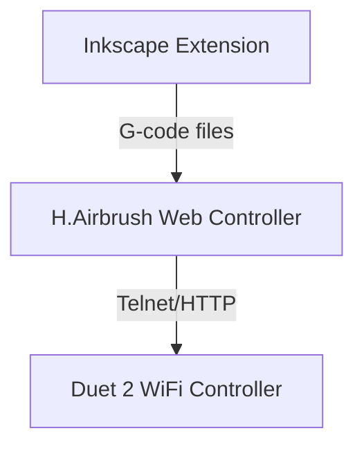

# Active Context

## Current Focus
We are implementing the H.Airbrush system architecture with three main components:
1. **Inkscape Extension** - SVG processing and G-code generation
2. **Web Controller** - Machine control and monitoring interface
3. **Duet 2 WiFi Controller** - Hardware control and execution

The immediate focus is on ensuring reliable G-code generation. We recently fixed an issue where the G-code output contained only comments and no movement commands by reverting the path batching system while keeping other improvements.

## Key Accomplishments
1. **Extension Redesign**
   - Created modular architecture following AxiDraw extension model
   - Implemented `hairbrush.inx` and `hairbrush_control.py` as main entry points
   - Added proper error handling and logging

2. **Architecture Planning**
   - Defined clear component responsibilities and interfaces
   - Created communication flow between components
   - Established data models for G-code, configuration, and job status

3. **G-code Optimization**
   - Fixed critical issue with G-code generation (no movement commands)
   - Simplified G-code output with cleaner formatting
   - Fixed slanted drawing issues by ensuring proper X-Y plane alignment
   - Improved airbrush parameter calculation based on physics model

## Architecture Overview
The H.Airbrush system follows a three-tier architecture:

### Component Responsibilities
- **Inkscape Extension**: SVG processing, path optimization, G-code generation
- **Web Controller**: Machine control interface, G-code management, status monitoring
- **Duet Controller**: Hardware control, G-code execution, status reporting

### Communication Flow
- Extension → Web Controller: G-code files
- Web Controller → Duet: Telnet (G-code), HTTP (status), WebSocket (updates)
- User → Web Controller: Browser-based UI

## Current Issues
- **Z-axis Performance**: Z-axis moves 20x slower than X/Y, requiring consideration in path planning
- **Path Processing**: Limited support for complex SVG path commands
- **Coordinate Transformation**: Ensuring proper X-Y plane alignment

## Next Steps
1. **GitHub Repository** - Create a new repository and push the working code
2. **Documentation** - Update user guide with latest changes
3. **Web Controller** - Begin implementation of the web interface component

## Dependencies
- Inkscape 1.0+ for testing the extension
- Python 3.8+ with minimal dependencies
- WSL environment for development

## ⚠️ CRITICAL DEVELOPMENT REQUIREMENTS ⚠️
- All command-line operations MUST be executed in WSL, NOT in Windows
- Use uv for virtual environment management
- Use pyproject.toml for dependency management
- Follow minimalist approach to dependencies 