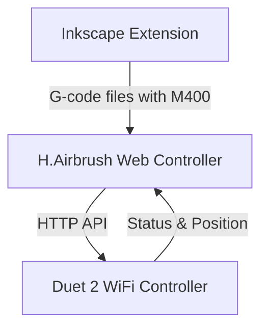

# Active Context

## Current Focus
We are implementing the H.Airbrush system architecture with three main components:
1. **Inkscape Extension** - SVG processing and G-code generation (95% complete)
2. **Web Controller** - Machine control and monitoring interface (95% complete)
3. **Duet 2 WiFi Controller** - Hardware control and execution (20% complete)

The immediate focus is on integrating the refactored JavaScript modules into the main application and testing with real hardware.

## Recent Changes

1. Removed static HTML test files:
   - Deleted standalone test pages (machine-state-test.html, command-engine-test.html, etc.)
   - Decided to rely on automated Vitest tests instead of manual test pages
   - Will use the real application UI for integration testing

2. Identified issues with JavaScript architecture integration:
   - Core modules and components have been developed and tested
   - Automated tests show good coverage (~84% for core modules, ~100% for components)
   - However, the main application (control.js) still uses the old architecture
   - No imports of the new modules in the main application files

3. Implemented core architecture modules:
   - Created machine-state.js module for centralized state management
   - Created command-engine.js module for hardware command abstraction
   - Created websocket-client.js module for standardized communication
   - Created error-handler.js for standardized error handling
   - Created UI components (brush-control.js, movement-control.js, visualization.js)

4. Implemented automated testing framework:
   - Set up Vitest with JSDOM for browser environment simulation
   - Created tests for all core modules and components
   - Added test coverage reporting with @vitest/coverage-v8
   - Achieved ~84% coverage for core modules and ~100% for components

5. Fixed dependency issues by consolidating pyproject.toml files into one root file.

## Architecture Overview

### Component Responsibilities
- **Inkscape Extension**: SVG processing, path optimization, G-code generation with M400 sync points
- **Web Controller**: Machine control interface, G-code management, status monitoring, M400 handling, endstop monitoring, settings persistence
- **Duet Controller**: Hardware control, G-code execution, status reporting, endstop status

## Current Development Focus

1. **JavaScript Architecture Integration**
   - Create app.js as main application entry point
   - Integrate refactored modules into main application
   - Replace global state with MachineState module
   - Replace direct WebSocket usage with WebSocketClient
   - Implement proper dependency injection between modules

2. **Testing with Real Hardware**
   - Test the refactored components with real hardware
   - Verify that all functionality works as expected
   - Test endstop monitoring and homing procedures
   - Measure and document Z vs X/Y performance characteristics

3. **Documentation and Deployment**
   - Create user guide for web controller
   - Document API endpoints
   - Create deployment instructions
   - Add configuration examples

## Integration Plan

1. **Start with Small Components**:
   - Begin by replacing brush controls with the new BrushControl component
   - Then replace movement controls with MovementControl
   - Finally, replace visualization with the new Visualization component

2. **Replace Global State Management**:
   - Migrate from global variables to MachineState
   - Update all state references to use MachineState methods

3. **Standardize WebSocket Communication**:
   - Use WebSocketClient consistently for all communication
   - Ensure all commands go through CommandEngine

## Windows/WSL Environment Issues

Currently experiencing issues with the Windows/WSL environment:
- Previously running the application in Windows using a shared codebase through WSL
- This is no longer working properly despite rebuilding the virtual environment
- The WSL environment is unsuitable for serial ports, which is why Windows was used
- Need to resolve these environment issues to properly test with hardware

## ⚠️ CRITICAL DEVELOPMENT REQUIREMENTS ⚠️
- All command-line operations MUST be executed in WSL, NOT in Windows
- Use uv for virtual environment management
- Use pyproject.toml for dependency management
- Follow minimalist approach to dependencies 