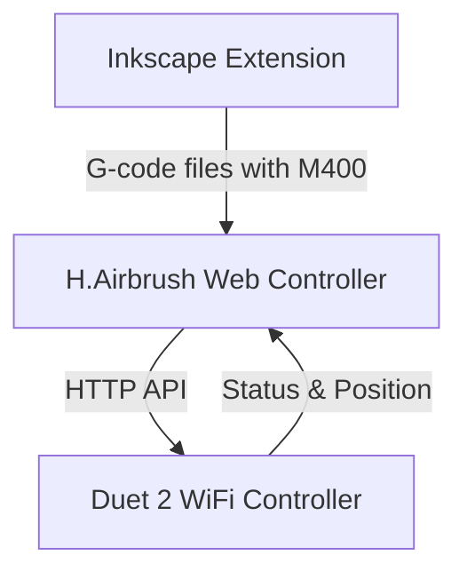

# Active Context

## Current Focus
We are implementing the H.Airbrush system architecture with three main components:
1. **Inkscape Extension** - SVG processing and G-code generation (95% complete)
2. **Web Controller** - Machine control and monitoring interface (92% complete)
3. **Duet 2 WiFi Controller** - Hardware control and execution (20% complete)

The immediate focus is on completing the Web Controller component with testing, optimization, and documentation. The core functionality has been implemented, including G-code file management, machine control, status monitoring, and endstop monitoring via communication with the Duet 2 WiFi board.

## Recent Implementations
1. **Machine Control UI Improvements**
   - Reorganized the machine control layout for better usability
   - Moved endstop monitoring to the top of the control panel
   - Added position display as a third column next to Z controls
   - Fixed JavaScript errors related to duplicate socket declarations
   - Added missing helper functions for movement control

2. **Endstop Monitoring Feature**
   - Added UI component to display endstop status in real-time
   - Implemented M119 command handling in the DuetClient class
   - Added automatic polling of endstop status every 5 seconds
   - Created visual indicators with color-coded status badges

3. **JavaScript Error Resolution**
   - Fixed duplicate socket variable declaration
   - Implemented proper socket connection management
   - Added missing helper functions for movement control
   - Improved error handling and feedback

## Key Accomplishments
1. **Inkscape Extension**
   - Created modular architecture following AxiDraw model
   - Implemented SVG parsing with layer detection
   - Fixed critical G-code generation issues
   - Added M400 commands for motion synchronization

2. **Web Controller**
   - Created Flask application with WebSocket support
   - Implemented Duet client for HTTP API communication
   - Developed job management and machine control
   - Built responsive web UI with dashboard and control panel
   - Added support for processing G-code files with M400 synchronization points
   - Implemented endstop monitoring with real-time status display
   - Improved machine control interface layout and usability

3. **Architecture Planning**
   - Defined component responsibilities and interfaces
   - Established data models and communication protocols
   - Documented system architecture and design decisions

## Architecture Overview

### Component Responsibilities
- **Inkscape Extension**: SVG processing, path optimization, G-code generation with M400 sync points
- **Web Controller**: Machine control interface, G-code management, status monitoring, M400 handling, endstop monitoring
- **Duet Controller**: Hardware control, G-code execution, status reporting, endstop status

## Duet Communication Strategy
- **HTTP API Communication**: Used for G-code commands and status monitoring (port 80)
- **Motion Synchronization**: Use `M400` to wait for moves to complete (IMPLEMENTED)
- **Position Monitoring**: Use `M114` to query current position (IMPLEMENTED)
- **Endstop Monitoring**: Use `M119` to query endstop status (IMPLEMENTED)
- **Hybrid Approach** (IMPLEMENTED):
  1. Insert `M400` after each complete stroke in G-code
  2. Recognize `M400` as blocking sync points in controller
  3. Inject additional `M400` for live operations

## Current Development Focus
We are focusing on the following areas:

1. **Testing and Optimization**
   - Test with real hardware
   - Optimize performance for real-time control
   - Implement error recovery mechanisms
   - Add comprehensive logging

2. **Documentation and Deployment**
   - Create user guide for web controller
   - Document API endpoints
   - Create deployment instructions

3. **Integration Testing**
   - Test end-to-end workflow from Inkscape to hardware
   - Verify brush control commands
   - Test endstop monitoring and homing procedures

## Current Issues
- **Z-axis Performance**: Z-axis moves 20x slower than X/Y
- **Error Recovery**: Need robust error handling for hardware communication
- **Performance Optimization**: WebSocket communication needs optimization
- **Testing with Real Hardware**: Need to verify functionality with actual hardware

## Completed Issues
- **Motion Synchronization**: Implemented proper `M400` handling with hybrid approach
- **Endstop Monitoring**: Implemented real-time endstop status monitoring with M119
- **HTTP API Communication**: Migrated from Telnet to HTTP API for Duet communication
- **UI Layout**: Improved machine control interface layout for better usability
- **JavaScript Errors**: Fixed duplicate socket declaration and added missing functions

## ⚠️ CRITICAL DEVELOPMENT REQUIREMENTS ⚠️
- All command-line operations MUST be executed in WSL, NOT in Windows
- Use uv for virtual environment management
- Use pyproject.toml for dependency management
- Follow minimalist approach to dependencies 