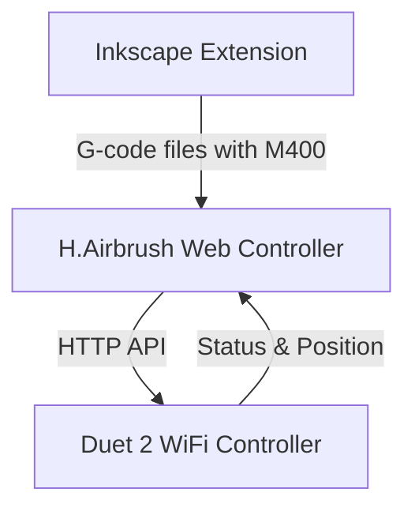

# Active Context

## Current Focus
We are implementing the H.Airbrush system architecture with three main components:
1. **Inkscape Extension** - SVG processing and G-code generation (95% complete)
2. **Web Controller** - Machine control and monitoring interface (95% complete)
3. **Duet 2 WiFi Controller** - Hardware control and execution (20% complete)

The immediate focus is on completing the Web Controller component with testing, optimization, and documentation. The core functionality has been implemented, including G-code file management, machine control, status monitoring, endstop monitoring, and settings persistence.

## Recent Implementations

1. **Visualization Improvements**
   - Replaced DOM/CSS-based visualization with HTML5 Canvas implementation
   - Fixed brush position visualization with proper offsets
   - Added grid lines with numeric scale indicators
   - Implemented proper origin (0,0) at center of paper
   - Added high-DPI support for retina displays
   - Improved brush position updates with real-time feedback
   - Added position and brush offset text display
   - Ensured visualization updates when brush offsets change in settings

2. **Settings Persistence**
   - Created settings.js to handle loading and saving settings
   - Added API endpoints for getting and setting configuration
   - Implemented settings persistence to config.yaml file
   - Connected settings changes to visualization updates
   - Added toast notifications for settings feedback
   - Fixed connection handling in the settings page
   - Implemented test connection functionality

3. **Movement Control Fixes**
   - Fixed jog controls to respect selected distance and speed settings
   - Modified jog button handling to use direction from button but magnitude from selected distance
   - Updated Z-axis home button to properly send G28 Z command
   - Improved error handling in movement control functions
   - Added Enable Motors button as toggle counterpart to Disable Motors (using M17 command)
   - Converted brush control buttons to toggle style with visual state indication
   - Added paint intensity sliders with percentage control for precise paint flow adjustment
   - Improved paint control layout with full-width buttons and sliders positioned below
   - Disabled jog and home buttons when motors are disabled for safety

4. **Command History Improvements**
   - Expanded command history to support up to 100 entries (up from 10)
   - Added command count badge to show number of commands in history
   - Implemented clear history button functionality
   - Fixed "removeChild" error that occurred when sending G-code commands
   - Enhanced command history UI with better styling and scrolling
   - Added error handling to prevent UI disruption from DOM exceptions

5. **Endstop Monitoring Improvements**
   - Fixed Z endstop status parsing to handle RepRapFirmware's Z probe information
   - Implemented more robust regex pattern for M119 response parsing
   - Added fallback parsing approach for complex endstop responses
   - Updated documentation to include information about Z probe responses
   - Improved error handling for endstop status parsing
   - Eliminated UI blinking by only updating endstop indicators when status changes

## Key Accomplishments
1. **Inkscape Extension**
   - Created modular architecture following AxiDraw model
   - Implemented SVG parsing with layer detection
   - Fixed critical G-code generation issues
   - Added M400 commands for motion synchronization

2. **Web Controller**
   - Created Flask application with WebSocket support
   - Implemented Duet client for HTTP API communication
   - Developed job management and machine control
   - Built responsive web UI with dashboard and control panel
   - Added support for processing G-code files with M400 synchronization points
   - Implemented endstop monitoring with real-time status display
   - Improved machine control interface layout and usability
   - Created canvas-based visualization with proper scaling and offsets
   - Implemented settings persistence to config.yaml

3. **Architecture Planning**
   - Defined component responsibilities and interfaces
   - Established data models and communication protocols
   - Documented system architecture and design decisions

## Architecture Overview

### Component Responsibilities
- **Inkscape Extension**: SVG processing, path optimization, G-code generation with M400 sync points
- **Web Controller**: Machine control interface, G-code management, status monitoring, M400 handling, endstop monitoring, settings persistence
- **Duet Controller**: Hardware control, G-code execution, status reporting, endstop status

## Duet Communication Strategy
- **HTTP API Communication**: Used for G-code commands and status monitoring (port 80)
- **Motion Synchronization**: Use `M400` to wait for moves to complete (IMPLEMENTED)
- **Position Monitoring**: Use `M114` to query current position (IMPLEMENTED)
- **Endstop Monitoring**: Use `M119` to query endstop status (IMPLEMENTED)
- **Hybrid Approach** (IMPLEMENTED):
  1. Insert `M400` after each complete stroke in G-code
  2. Recognize `M400` as blocking sync points in controller
  3. Inject additional `M400` for live operations

## Current Development Focus
We are focusing on the following areas:

1. **Testing and Optimization**
   - Test with real hardware
   - Optimize performance for real-time control
   - Implement error recovery mechanisms
   - Add comprehensive logging

2. **Documentation and Deployment**
   - Create user guide for web controller
   - Document API endpoints
   - Create deployment instructions

3. **Integration Testing**
   - Test end-to-end workflow from Inkscape to hardware
   - Verify brush control commands
   - Test endstop monitoring and homing procedures

## Current Issues
- **Z-axis Performance**: Z-axis moves 20x slower than X/Y
- **Error Recovery**: Need robust error handling for hardware communication
- **Performance Optimization**: WebSocket communication needs optimization
- **Testing with Real Hardware**: Need to verify functionality with actual hardware

## Completed Issues
- **Motion Synchronization**: Implemented proper `M400` handling with hybrid approach
- **Endstop Monitoring**: Implemented real-time endstop status monitoring with M119
- **HTTP API Communication**: Migrated from Telnet to HTTP API for Duet communication
- **UI Layout**: Improved machine control interface layout for better usability
- **JavaScript Errors**: Fixed duplicate socket declaration and added missing functions
- **Visualization**: Replaced DOM/CSS visualization with Canvas implementation
- **Settings Persistence**: Implemented settings persistence to config.yaml

## ⚠️ CRITICAL DEVELOPMENT REQUIREMENTS ⚠️
- All command-line operations MUST be executed in WSL, NOT in Windows
- Use uv for virtual environment management
- Use pyproject.toml for dependency management
- Follow minimalist approach to dependencies 