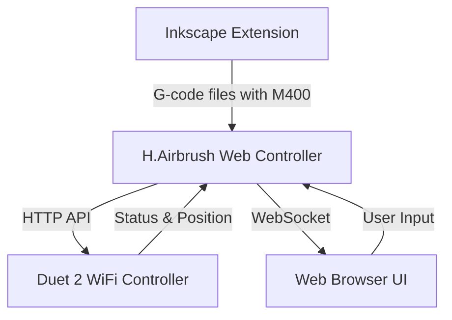

# System Architecture and Design Patterns

## Overall Architecture

The H.Airbrush system follows a three-component architecture:



### Component Responsibilities

1. **Inkscape Extension**
   - SVG processing and path optimization
   - G-code generation with M400 synchronization points
   - Layer-based processing for brush selection
   - Installation and configuration management

2. **Web Controller**
   - Flask-based web server with SocketIO for real-time communication
   - HTTP API communication with Duet board
   - G-code file management and processing
   - Machine control and status monitoring
   - Web-based user interface
   - Canvas-based visualization
   - Settings persistence to config.yaml

3. **Duet 2 WiFi Controller**
   - Hardware control via RepRapFirmware
   - G-code execution and motion control
   - Status reporting and position tracking
   - Endstop monitoring and homing procedures

## Key Design Patterns

### 1. HTTP API Communication

The Web Controller communicates with the Duet 2 WiFi board using its HTTP API:

```python
# Send G-code command
encoded_gcode = urllib.parse.quote(gcode)
url = f"http://{host}:{port}/rr_gcode?gcode={encoded_gcode}"
response = session.get(url)

# Get response
reply_response = session.get(f"http://{host}:{port}/rr_reply")
reply_text = reply_response.text.strip()
```

### 2. WebSocket Real-time Updates

The Web Controller uses Socket.IO for real-time communication with the browser:

```javascript
// Server-side (Python)
@socketio.on('command')
def handle_command(data):
    command = data.get('command')
    result = duet_client.send_command(command)
    return {'status': 'success', 'result': result}

// Client-side (JavaScript)
socket.emit('command', { command: 'M119' }, (response) => {
    if (response && response.status === 'success') {
        updateEndstopUI(response.result.response);
    }
});
```

### 3. Canvas-based Visualization

We use HTML5 Canvas for machine visualization with proper scaling and offsets:

```javascript
class MachineVisualization {
    constructor(containerId, config = {}) {
        // Initialize canvas
        this.canvas = document.createElement('canvas');
        this.container = document.getElementById(containerId);
        this.container.appendChild(this.canvas);
        
        // Set up high-DPI support
        const dpr = window.devicePixelRatio || 1;
        this.canvas.width = rect.width * dpr;
        this.canvas.height = rect.height * dpr;
        this.ctx = this.canvas.getContext('2d');
        this.ctx.scale(dpr, dpr);
        
        // Calculate scaling to fit paper in visualization
        this.scale = Math.min(scaleX, scaleY);
        
        // Set origin to center of paper
        this.originX = this.paperLeft + (this.paperWidthPx / 2);
        this.originY = this.paperTop + (this.paperHeightPx / 2);
    }
    
    // Update position based on machine coordinates
    updatePosition(position) {
        // Update position
        if (position.X !== undefined) this.position.X = position.X;
        if (position.Y !== undefined) this.position.Y = position.Y;
        if (position.Z !== undefined) this.position.Z = position.Z;
        
        // Redraw
        this.draw();
    }
    
    // Update configuration (e.g., brush offsets)
    updateConfig(config) {
        this.config = { ...this.config, ...config };
        this.draw();
    }
}
```

### 4. Settings Persistence

We use a structured approach to settings persistence with API endpoints and config file:

```python
# Server-side (Python)
@app.route('/api/settings', methods=['GET'])
def get_settings():
    """Get all settings."""
    return jsonify(config.config)

@app.route('/api/settings', methods=['POST'])
def update_settings():
    """Update settings."""
    settings = request.json
    
    # Update settings
    for section, values in settings.items():
        if isinstance(values, dict):
            # Handle nested sections
            for key, value in values.items():
                config.set(f"{section}.{key}", value)
        else:
            # Handle top-level settings
            config.set(section, values)
    
    # Save configuration to file
    config.save()
    
    return jsonify({"success": True, "config": config.config})

# Client-side (JavaScript)
function saveSettings(settings, successMessage) {
    fetch('/api/settings', {
        method: 'POST',
        headers: {
            'Content-Type': 'application/json'
        },
        body: JSON.stringify(settings)
    })
    .then(response => response.json())
    .then(data => {
        // Update visualization if brush offsets changed
        if (settings.brushes && window.machineVisualization) {
            window.machineVisualization.updateConfig({
                brushBOffsetX: settings.brushes.b.offset_x,
                brushBOffsetY: settings.brushes.b.offset_y
            });
        }
    });
}
```

### 5. Motion Synchronization with M400

We use a hybrid approach for motion synchronization:

1. Insert M400 commands at strategic points in G-code
2. Use wait_for_motion_complete method in DuetClient
3. Process M400 commands as synchronization points

```python
def wait_for_motion_complete(self):
    """Wait for all motion to complete (M400)."""
    try:
        result = self.send_command('M400')
        return {"status": "success", "response": "Motion complete"}
    except Exception as e:
        logger.error(f"Error waiting for motion to complete: {e}")
        return {"status": "error", "message": str(e)}
```

### 6. Endstop Monitoring

Endstop monitoring uses the M119 command and color-coded status indicators:

```javascript
// Send M119 command to query endstops
socket.emit('command', { command: 'M119' }, (response) => {
    if (response && response.status === 'success') {
        updateEndstopUI(response.result.response);
    }
});

// Update UI based on endstop status
function updateEndstopUI(response) {
    // Parse response: "Endstops - X: not stopped, Y: not stopped, Z: not stopped"
    // Update status indicators with appropriate colors:
    // - Green: Not triggered
    // - Red: Triggered
    // - Yellow: Warning/unknown
    // - Gray: Loading
}
```

## Design Decisions

### 1. Canvas vs. DOM for Visualization

**Decision**: Replaced DOM/CSS-based visualization with HTML5 Canvas implementation.

**Rationale**:
- Canvas provides better performance for real-time updates
- More precise control over drawing and positioning
- Better support for scaling and transformations
- Simplified code for brush position updates
- Support for high-DPI displays
- Easier to add features like grid lines with scale indicators

### 2. Settings Persistence Architecture

**Decision**: Implemented structured settings persistence with API endpoints and config file.

**Rationale**:
- Centralized configuration management
- Clear separation between UI and configuration storage
- Automatic persistence to file system
- Support for nested configuration objects
- Real-time updates to visualization when settings change
- Consistent approach across all settings types

### 3. HTTP API vs. Telnet

**Decision**: Migrated from Telnet to HTTP API for Duet communication.

**Rationale**:
- HTTP API is more reliable and better supported in newer Duet firmware
- Telnet support was removed in RepRapFirmware 3.4.6
- HTTP API provides better error handling and status reporting
- Session management is more robust with HTTP

### 4. Machine Control Layout

**Decision**: Reorganized machine control layout with endstops at top, visualization next, and controls below.

**Rationale**:
- Endstop status is critical safety information and should be immediately visible
- Position visualization provides spatial context for movement controls
- Three-column layout (XY, Z, Position) provides logical grouping and efficient use of space
- Movement parameters directly below controls creates a natural workflow

### 5. Socket Management

**Decision**: Implemented global socket management to avoid duplicate declarations.

**Rationale**:
- Single source of truth for socket connection
- Prevents "Identifier 'socket' has already been declared" errors
- Improves code maintainability and reduces bugs
- Centralizes connection management logic 