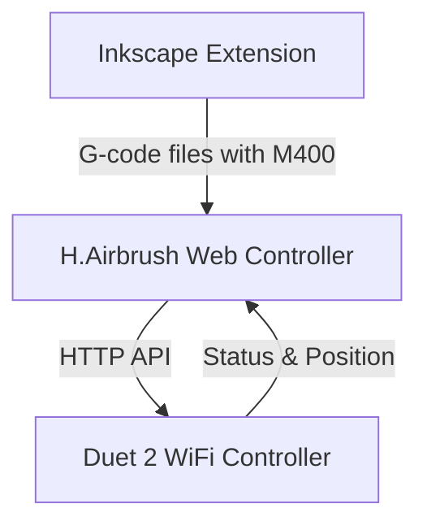
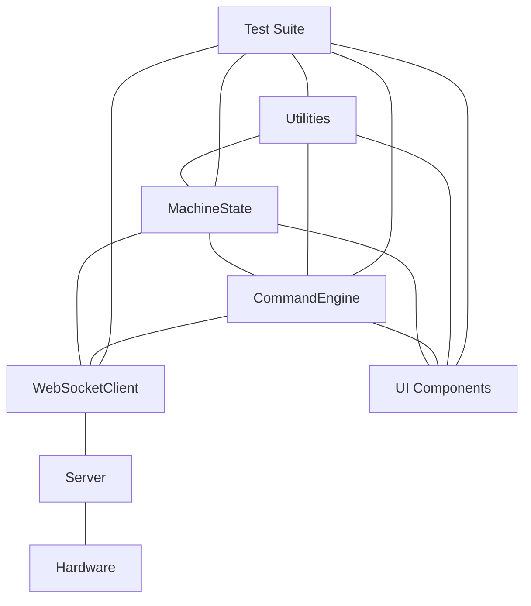

# System Patterns

## Architecture Overview

The H.Airbrush system consists of three main components:

1. **Inkscape Extension**: Processes SVG files and generates G-code with M400 synchronization points
2. **Web Controller**: Provides machine control interface and manages G-code execution
3. **Duet 2 WiFi Controller**: Executes G-code commands and controls hardware

## JavaScript Architecture

The JavaScript architecture follows a modular design with clear separation of concerns:

### Core Modules

1. **MachineState Module**:
   - Singleton pattern for centralized state management
   - Observable pattern for state change notifications
   - Validation for all state changes
   - Event-based subscription system

2. **CommandEngine Module**:
   - Command abstraction for hardware operations
   - Integration with MachineState for state updates
   - Validation and error handling for commands
   - High-level methods for movement, brush control, and motor operations

3. **WebSocketClient Module**:
   - Robust connection management with automatic reconnection
   - Message queuing for offline scenarios
   - Standardized message format and error handling
   - Event-based communication system

4. **Utilities Module**:
   - Common utility functions shared across modules
   - Debounce function for rate-limiting operations
   - Number formatting with configurable precision
   - Servo angle calculation for brush control
   - Range validation and clamping functions

## Communication Patterns

### Client-Server Communication
- WebSocket for real-time bidirectional communication
- HTTP API for configuration and file management
- Event-based architecture for state updates

### Server-Hardware Communication
- HTTP API for G-code command execution
- Polling for status updates
- M400 commands for motion synchronization

## Data Flow Patterns

### State Management
- Single source of truth for machine state
- Unidirectional data flow from state to UI
- Event-based updates for real-time feedback

### Command Execution
1. UI triggers command
2. CommandEngine validates and formats command
3. WebSocketClient sends command to server
4. Server forwards command to hardware
5. Hardware executes command
6. Status update flows back to UI

## Error Handling Patterns

1. **Client-Side Validation**:
   - Input validation before command execution
   - State validation to prevent invalid operations

2. **Communication Error Handling**:
   - Automatic reconnection for WebSocket
   - Message queuing for offline scenarios
   - Timeout handling for requests

3. **Server-Side Error Handling**:
   - Graceful degradation for hardware communication issues
   - Comprehensive logging for troubleshooting
   - User feedback for critical errors

## UI Patterns

1. **Component-Based Architecture**:
   - Modular UI components with clear responsibilities
   - Event-based communication between components
   - State-driven UI updates

2. **Responsive Design**:
   - Bootstrap 5 for responsive layout
   - Mobile-friendly controls
   - Adaptive visualization

## Testing Patterns

1. **Unit Testing**:
   - Test individual modules in isolation using Vitest
   - Mock dependencies with vi.mock() for controlled testing
   - Test files co-located with implementation files
   - Comprehensive test coverage (84%+ for core modules)

2. **Component Testing**:
   - Test UI components with JSDOM simulation
   - Mock DOM elements and event handling
   - Verify component behavior and interactions
   - Achieve 100% test coverage for components

3. **Integration Testing**:
   - Test module interactions with combined mocks
   - Verify communication patterns between modules
   - Test complex workflows with multiple components
   - Ensure proper event propagation between components

4. **Testing Utilities**:
   - Common test helpers for DOM element creation
   - Mock factories for WebSocket and other dependencies
   - Test data generators for consistent test scenarios
   - Custom assertions for common validation patterns

5. **Test Organization**:
   - Tests located alongside implementation files
   - Consistent naming pattern with .test.js suffix
   - Grouped tests by functionality using describe blocks
   - Clear test descriptions with it/test functions

## ⚠️ CRITICAL DEVELOPMENT REQUIREMENTS ⚠️
- All command-line operations MUST be executed in WSL, NOT in Windows
- Use uv for virtual environment management instead of venv/virtualenv
- Use pyproject.toml for dependency management instead of requirements.txt
- Follow minimalist approach to dependencies 