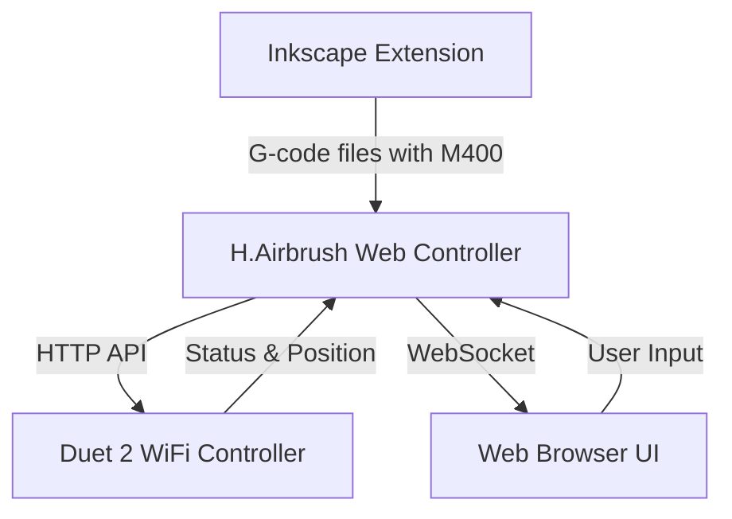

# System Architecture and Design Patterns

## Overall Architecture

The H.Airbrush system follows a three-component architecture:



### Component Responsibilities

1. **Inkscape Extension**
   - SVG processing and path optimization
   - G-code generation with M400 synchronization points
   - Layer-based processing for brush selection
   - Installation and configuration management

2. **Web Controller**
   - Flask-based web server with SocketIO for real-time communication
   - HTTP API communication with Duet board
   - G-code file management and processing
   - Machine control and status monitoring
   - Web-based user interface

3. **Duet 2 WiFi Controller**
   - Hardware control via RepRapFirmware
   - G-code execution and motion control
   - Status reporting and position tracking
   - Endstop monitoring and homing procedures

## Key Design Patterns

### 1. HTTP API Communication

The Web Controller communicates with the Duet 2 WiFi board using its HTTP API:

```python
# Send G-code command
encoded_gcode = urllib.parse.quote(gcode)
url = f"http://{host}:{port}/rr_gcode?gcode={encoded_gcode}"
response = session.get(url)

# Get response
reply_response = session.get(f"http://{host}:{port}/rr_reply")
reply_text = reply_response.text.strip()
```

### 2. WebSocket Real-time Updates

The Web Controller uses Socket.IO for real-time communication with the browser:

```javascript
// Server-side (Python)
@socketio.on('command')
def handle_command(data):
    command = data.get('command')
    result = duet_client.send_command(command)
    return {'status': 'success', 'result': result}

// Client-side (JavaScript)
socket.emit('command', { command: 'M119' }, (response) => {
    if (response && response.status === 'success') {
        updateEndstopUI(response.result.response);
    }
});
```

### 3. Motion Synchronization with M400

We use a hybrid approach for motion synchronization:

1. Insert M400 commands at strategic points in G-code
2. Use wait_for_motion_complete method in DuetClient
3. Process M400 commands as synchronization points

```python
def wait_for_motion_complete(self):
    """Wait for all motion to complete (M400)."""
    try:
        result = self.send_command('M400')
        return {"status": "success", "response": "Motion complete"}
    except Exception as e:
        logger.error(f"Error waiting for motion to complete: {e}")
        return {"status": "error", "message": str(e)}
```

### 4. Machine Control Interface Layout

The machine control interface follows a structured layout pattern:

```
+------------------------------------------+
| Endstop Status (X, Y, Z)                 |
+------------------------------------------+
| Position Visualization                   |
|                                          |
+------------------------------------------+
| XY Control | Z Control | Position Display |
+------------------------------------------+
| Movement Distance & Speed Controls       |
+------------------------------------------+
| Quick Actions (Home, Park, etc.)         |
+------------------------------------------+
```

This layout prioritizes:
- Endstop status at the top for immediate visibility
- Position visualization for spatial awareness
- Logical grouping of XY and Z controls
- Position display adjacent to movement controls
- Movement parameters (distance/speed) below controls
- Quick actions at the bottom for easy access

### 5. Endstop Monitoring

Endstop monitoring uses the M119 command and color-coded status indicators:

```javascript
// Send M119 command to query endstops
socket.emit('command', { command: 'M119' }, (response) => {
    if (response && response.status === 'success') {
        updateEndstopUI(response.result.response);
    }
});

// Update UI based on endstop status
function updateEndstopUI(response) {
    // Parse response: "Endstops - X: not stopped, Y: not stopped, Z: not stopped"
    // Update status indicators with appropriate colors:
    // - Green: Not triggered
    // - Red: Triggered
    // - Yellow: Warning/unknown
    // - Gray: Loading
}
```

## Design Decisions

### 1. HTTP API vs. Telnet

**Decision**: Migrated from Telnet to HTTP API for Duet communication.

**Rationale**:
- HTTP API is more reliable and better supported in newer Duet firmware
- Telnet support was removed in RepRapFirmware 3.4.6
- HTTP API provides better error handling and status reporting
- Session management is more robust with HTTP

### 2. Machine Control Layout

**Decision**: Reorganized machine control layout with endstops at top, visualization next, and controls below.

**Rationale**:
- Endstop status is critical safety information and should be immediately visible
- Position visualization provides spatial context for movement controls
- Three-column layout (XY, Z, Position) provides logical grouping and efficient use of space
- Movement parameters directly below controls creates a natural workflow

### 3. Socket Management

**Decision**: Implemented global socket management to avoid duplicate declarations.

**Rationale**:
- Single source of truth for socket connection
- Prevents "Identifier 'socket' has already been declared" errors
- Improves code maintainability and reduces bugs
- Centralizes connection management logic

### 4. Position Display

**Decision**: Added position display as a third column next to Z controls.

**Rationale**:
- Provides immediate feedback adjacent to movement controls
- Reduces eye movement between controls and position information
- Creates a more cohesive user experience
- Improves efficiency during machine operation 